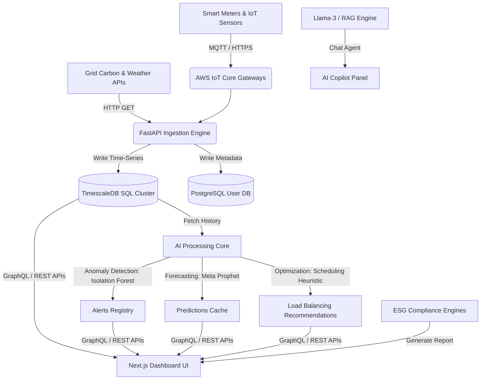

# Product Requirement Document (PRD)

## Product Name: PRAGATI AI — Industrial Sustainability Intelligence Platform
**Version:** 1.0.0  
**Date:** May 30, 2026  
**Author:** Team PRAGATI  
**Target Audience:** Cambridge University Sustainability Hackathon 2026 / Investors & Judges  

---

## 1. Executive Summary

### 1.1 Product Overview
**PRAGATI AI** (Industrial Sustainability Intelligence Platform) is an enterprise-grade AI-powered SaaS platform that transforms factory floor operations from reactive energy monitoring to intelligent sustainability optimization. By ingesting real-time IoT sensor telemetry, smart energy meter streams, and regional grid carbon intensity data, the platform detects energy anomalies, forecasts carbon footprints, schedules heavy machine workloads to match renewable availability, and automates ESG reporting.

### 1.2 Tagline
> *"Transforming Industries from Reactive Monitoring to Intelligent Sustainability Optimization"*

### 1.3 Core Value Proposition
* **Decarbonization**: Unlocks up to 45% reduction in industrial carbon footprints.
* **Energy Cost Reduction**: Yields up to 30% savings in factory utility bills by avoiding peak-grid tariffs and maximizing solar utilization.
* **Compliance & Auditing**: Streamlines ESG reporting from months to a single click, eliminating manual audit penalties.
* **Operational Efficiency**: Identifies machinery idling and energy leaks using AI, minimizing downtime and overhead.

---

## 2. Problem Statement & Market Opportunity

### 2.1 The Problem
Modern industrial plants face a compounding sustainability and operational crisis:
1. **Severe Energy Wastage**: On average, factories waste **30% to 40%** of their total energy intake due to unoptimized machine cycles, left-on idle machinery, and inefficient heating/cooling.
2. **Rising Carbon Emissions**: The industrial sector contributes **21% of global greenhouse gas emissions**. Tightening regional carbon taxation makes high emissions a financial liability.
3. **Manual, Error-Prone ESG Audits**: Over **70% of companies** still rely on manual data collection for sustainability reporting (CDP, GRI, TCFD). This leads to audit delays, lack of transparency, and regulatory penalties.
4. **Poor Renewable Integration**: Only **12% of factories** run active scheduling that aligns production runs with on-site renewable energy generation (like solar/wind), wasting clean power.

### 2.2 Market Opportunity
With carbon taxes rising globally and investors prioritizing ESG compliance, factories must transition to active decarbonization. Existing SCADA and building management systems (BMS) only record raw consumption values; they lack the predictive, anomaly detection, and scheduling optimization engines to reduce utility bills.

---

## 3. Product Vision & Goals

### 3.1 Long-Term Vision
To become the standard AI-driven operating system for sustainable industrial operations, enabling carbon-neutral manufacturing worldwide.

### 3.2 Key Personas

#### Persona A: Factory Operations Manager (e.g., Prasad)
* **Goal**: Maximize daily production throughput while minimizing utility costs.
* **Pain Point**: No visibility into which machine is wasting energy, or when to schedule high-power operations to avoid peak rates.

#### Persona B: Corporate Sustainability / ESG Officer (e.g., Ananya)
* **Goal**: Compile accurate Scope 1, 2, and 3 carbon reports for board members and regulators.
* **Pain Point**: Spends months collecting energy bills and spreadsheets, with high risk of regulatory audit failure.

#### Persona C: Executive Leadership / CFO (e.g., Rohan)
* **Goal**: Achieve ESG pledges while safeguarding operational margins.
* **Pain Point**: Hard to justify green investments without clean ROI simulation data.

---

## 4. Functional Specifications & Feature Requirements

The platform is composed of six core operational modules:

```
┌────────────────────────────────────────────────────────┐
│                      PRAGATI AI                        │
├─────────────┬─────────────┬─────────────┬──────────────┤
│ Telemetry   │ Predictive  │ Anomaly     │ Load         │
│ & Ingestion │ Carbon ML   │ Detection   │ Balancing    │
├─────────────┴─────────────┼─────────────┴──────────────┤
│   Digital Twin Sandbox    │    ESG & AI Copilot Chat   │
└───────────────────────────┴────────────────────────────┘
```

### 4.1 Real-Time Telemetry & Data Ingestion
* **Description**: Ingests sub-second metrics from factory hardware and environmental sources.
* **Requirements**:
  * Ingest data from smart electricity meters (Active Power, Reactive Power, Voltage).
  * Connect to IoT vibration and temperature sensors on heavy machinery (lathes, compressors, ovens).
  * Pull live grid carbon emission factor APIs (g CO₂ / kWh) based on regional grids.
  * Ingest local weather APIs and on-site solar/wind yield forecasts.

### 4.2 AI-Powered Carbon & Energy Forecasting
* **Description**: Predicts future factory consumption and emissions to support proactive energy procurement and workload planning.
* **Requirements**:
  * Train and run Meta's `Prophet` time-series forecasting models.
  * Predict grid carbon intensity trends and factory demand curves for 30/60/90 days.
  * Provide visual confidence intervals (80% and 95%) for demand forecasting.

### 4.3 Anomaly & Energy Leak Detection
* **Description**: Automatically flags anomalous power spikes, machine idling, and sub-system failures.
* **Requirements**:
  * Implement unsupervised machine learning models (`Isolation Forest` or `One-Class SVM`).
  * Flag anomalies (e.g., CNC Lathe left idle overnight drawing 67% baseline power).
  * Trigger real-time dashboard notifications and webhooks for factory floor managers.

### 4.4 Renewable Load Balancing & Scheduling
* **Description**: Matches energy-intensive production cycles with cheap, on-site solar or low-tariff grid periods.
* **Requirements**:
  * Heuristic scheduling algorithm that recommends optimal run-times for high-power machines.
  * Workload-shifting logic to maximize solar self-consumption.
  * Battery charge/discharge scheduling optimization based on peak-hour forecasts.

### 4.5 Digital Twin Sandbox & Simulation
* **Description**: A virtual environment for testing factory operational configurations.
* **Requirements**:
  * Run "what-if" simulations (e.g., *"What is the emission ROI if I add 150kW solar panels?"*).
  * Calculate estimated ROI, payback period, and annual CO₂ reductions before executing physical changes.
  * Display simulation comparisons side-by-side with current historical baselines.

### 4.6 ESG Reporting & AI Copilot Chat
* **Description**: Simplifies auditing and floor operations using automated reports and natural language processing.
* **Requirements**:
  * Generate one-click, audit-ready compliance reports matching **GRI (Global Reporting Initiative)**, **TCFD**, and **CDP** standards.
  * Natural language sustainability chat assistant (AI Copilot) trained on factory configurations.
  * Allow managers to ask natural questions (e.g., *"Which sub-assembly line wasted the most energy last week?"*) and get immediate answers with actionable advice.

---

## 5. Non-Functional Requirements

### 5.1 Performance & Latency
* Live telemetry dashboard update latency must be under **1.5 seconds**.
* Anomaly detection algorithms must process inputs and flag alerts in under **2.0 seconds** of telemetry ingestion.
* Standard API response times must be under **300ms**.

### 5.2 Scalability & Database
* Time-series database must handle up to **10,000 writes/second** (representing 5,000 IoT sensors writing metrics at 2Hz).
* System must support multi-plant hierarchies (e.g., a corporate dashboard managing 5 separate geographical factory locations).

### 5.3 Security & Compliance
* End-to-end data encryption using TLS 1.3 in transit and AES-256 at rest.
* Role-Based Access Control (RBAC):
  * **Operator View**: Telemetry and scheduling alerts.
  * **Manager View**: Scheduling approvals, Digital Twin configurations, and report generation.
  * **Admin View**: User credentials, API keys, and model parameter tuning.

---

## 6. Technical Architecture & Data Flow



### 6.1 Data Pipeline Flow
1. **Ingest**: Sensors publish metrics (temperature, vibration, power) via MQTT; grid/weather APIs are queried by scheduled cron jobs.
2. **Process**: FastAPI backend validates, parses, and writes to TimescaleDB.
3. **Analyze**: Background workers run python models:
   * `Isolation Forest` detects outliers.
   * `Prophet` runs nightly forecasting updates.
   * `Optimization Solver` outputs scheduling suggestions.
4. **Present**: Next.js client renders SVG charts, alert lists, and RAG-powered chatbot interface.

---

## 7. Product Release Plan & Roadmap

### Phase 1 — MVP Development (Target: Q3 2026)
* Core IoT Ingestion pipelines (FastAPI + TimescaleDB).
* Real-time telemetry monitoring screens.
* Basic Scope 1 & 2 carbon tracking calculations.
* Export of monthly carbon footprint reports to PDF.

### Phase 2 — Intelligence Core (Target: Q4 2026)
* Deployment of Meta Prophet forecasting engine.
* Isolation Forest anomaly detection alerts.
* Interactive AI Copilot chat dashboard utilizing Llama-3.
* Automated ESG scoring and TCFD compliance exports.

### Phase 3 — Renewable Sandbox (Target: Q1 2027)
* Digital Twin simulation panel with custom panel arrays.
* Solar load-balancing scheduling algorithms.
* Smart battery charging schedules based on demand forecasting.

### Phase 4 — Global Enterprise Scaling (Target: Q2 2027)
* Multi-plant corporate aggregation console.
* Cross-border carbon tax calculator APIs.
* Integrations with SAP and Siemens factory control units.

---

## 8. Success Metrics & Key Performance Indicators (KPIs)

To evaluate the product's performance and value to the customer, the following metrics will be tracked:

| Category | Metric | Target | Formula / Measurement |
| :--- | :--- | :--- | :--- |
| **Sustainability** | Carbon Footprint Reduction | **-40% to -45%** | `(Pre-install CO₂ - Post-install CO₂) / Pre-install CO₂` |
| **Financial** | Energy Cost Savings | **-25% to -30%** | `(Pre-install Tariff Cost - Post-install Cost) / Pre-install Cost` |
| **Operational** | Machine Idle Wastage | **-50%** | Reduction in hours machines draw power without active workloads |
| **Auditing** | ESG Report Assembly Time | **99% reduction** | From **~30 days** average manual compile time to **under 5 minutes** |
| **System** | Anomaly Detection Accuracy | **>95% F1-Score** | Ratio of correctly flagged operational errors/spikes |
